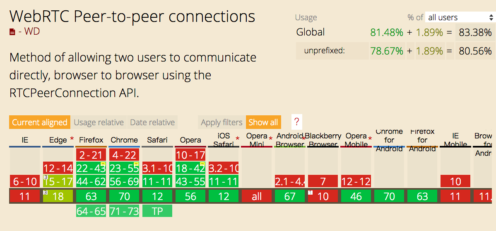

# Browers side get User's Internal IP

## install
```
npm install --save internalip
// or
yarn add internalip
```

## how to use
```javascript
import binternalip from 'binternalip';

// ...

binternalip
  .then(function (internalIP) {
    console.log('interanlIP => ' + internalIP)
    // interanlIP => 10.xx.xx.xxx
  })

```

## Browsers support check!!!
<font size="6"><a href="https://caniuse.com/#search=RTCPeerConnection">canisue search "RTCPeerConnection"</a></font>  

<p align="center">

</p>